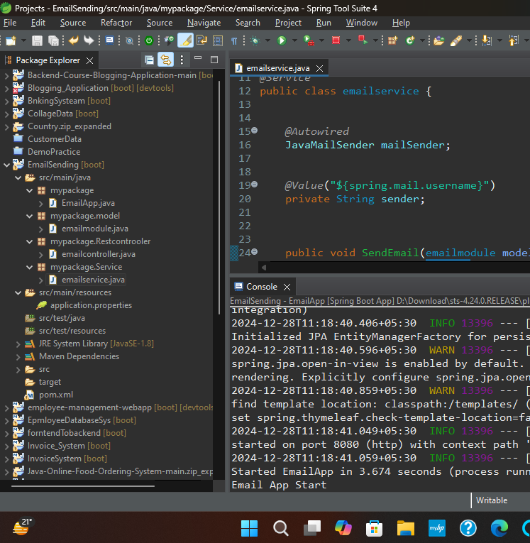

Sending emails through a Spring Boot application is a common requirement, especially for applications that need to send notifications, alerts, or welcome emails. Spring Boot simplifies the process of integrating email functionality through its support for JavaMail API.

Steps to Send Email in Spring Boot
Here’s a step-by-step guide to sending an email using Spring Boot:
JavaMailSender: This is the primary interface in Spring Boot for sending emails. It is configured through properties such as the SMTP server details (host, port, authentication, etc.).

SimpleMailMessage: A basic email message that includes the recipient, subject, body, and sender. This is used for sending plain text emails.

